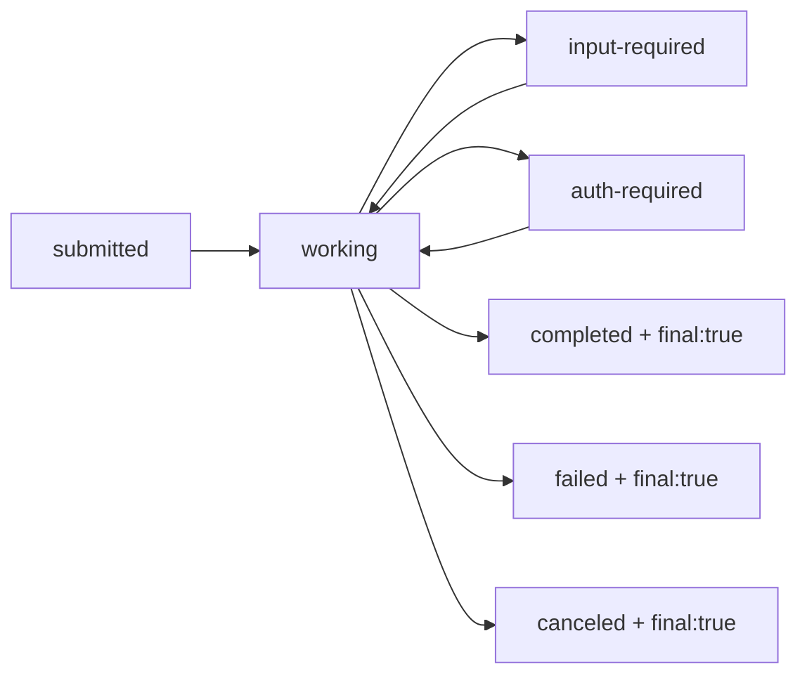

# A2A Protocol Streaming Reference Guide

## 🚀 Streaming-Enabled Methods

Only **2 methods** support streaming in A2A:

| Method | Purpose | Requirement |
|--------|---------|-------------|
| `message/stream` | Send message with real-time updates | Server must have `streaming: true` |
| `tasks/resubscribe` | Reconnect to existing stream | Server must have `streaming: true` |

## 📡 Streamable Event Types

### 1. Task Event
```json
{
  "kind": "task",
  "id": "task-id",
  "contextId": "context-id",
  "status": { "state": "working" },
  "artifacts": [],
  "history": []
}
```
- **Stream Unit**: Complete object
- **Chunkable**: ❌ No
- **Usage**: Initial task creation or full state updates

### 2. Message Event
```json
{
  "kind": "message",
  "role": "agent",
  "parts": [
    { "kind": "text", "text": "I'm processing your request..." }
  ],
  "messageId": "msg-id",
  "taskId": "task-id"
}
```
- **Stream Unit**: Complete object
- **Chunkable**: ❌ No
- **Usage**: Agent responses during processing

### 3. Status Update Event
```json
{
  "kind": "status-update",
  "taskId": "task-id",
  "contextId": "context-id",
  "status": {
    "state": "working",
    "timestamp": "2024-03-15T10:00:00Z"
  },
  "final": false  // true = stream will close
}
```
- **Stream Unit**: Complete event
- **Chunkable**: ❌ No
- **Special**: `final: true` terminates the stream

### 4. Artifact Update Event ⭐
```json
{
  "kind": "artifact-update",
  "taskId": "task-id",
  "contextId": "context-id",
  "artifact": {
    "artifactId": "art-id",
    "name": "report.md",
    "parts": [
      { "kind": "text", "text": "## Chapter 1\n..." }
    ]
  },
  "append": false,    // Chunking control
  "lastChunk": false  // Chunking control
}
```
- **Stream Unit**: Can be chunks!
- **Chunkable**: ✅ **YES** - The only chunkable event type
- **Usage**: Delivering large outputs incrementally

## 🔄 Artifact Chunking Patterns

### Starting a New Artifact
```json
{
  "kind": "artifact-update",
  "artifact": {
    "artifactId": "report-123",
    "parts": [{ "kind": "text", "text": "# Report\n\n## Introduction\n" }]
  },
  "append": false,    // Start fresh
  "lastChunk": false  // More chunks coming
}
```

### Appending Chunks
```json
{
  "kind": "artifact-update",
  "artifact": {
    "artifactId": "report-123",  // Same ID!
    "parts": [{ "kind": "text", "text": "This section continues..." }]
  },
  "append": true,     // Add to existing
  "lastChunk": false  // Still more coming
}
```

### Final Chunk
```json
{
  "kind": "artifact-update",
  "artifact": {
    "artifactId": "report-123",  // Same ID!
    "parts": [{ "kind": "text", "text": "## Conclusion\n\nThe end." }]
  },
  "append": true,    // Add to existing
  "lastChunk": true  // This completes the artifact
}
```

## 📊 Task State Flow in Streams

States you'll see in `status-update` events:



## 🎯 What Can and Cannot Stream

### ✅ Can Stream
- Task state transitions
- Agent messages during processing
- Artifacts (with chunking!)
- Multiple artifacts per task

### ❌ Cannot Stream
- Individual message parts
- Partial file uploads (client → server)
- Binary data chunks within FilePart
- Real-time bidirectional communication

## 💡 Practical Streaming Scenarios

### Scenario 1: Quick Response
```
1. Client: message/stream → "What's 2+2?"
2. Server: Task (submitted)
3. Server: StatusUpdate (working)
4. Server: Message "The answer is 4"
5. Server: StatusUpdate (completed, final: true)
[Stream closes]
```

### Scenario 2: Long Document Generation
```
1. Client: message/stream → "Write a 10-page report"
2. Server: Task (submitted)
3. Server: StatusUpdate (working)
4. Server: ArtifactUpdate (chunk 1, append: false)
5. Server: ArtifactUpdate (chunk 2, append: true)
6. Server: ArtifactUpdate (chunk 3, append: true)
... [many more chunks]
47. Server: ArtifactUpdate (final chunk, lastChunk: true)
48. Server: StatusUpdate (completed, final: true)
[Stream closes]
```

### Scenario 3: Multi-Step Process
```
1. Client: message/stream → "Analyze these files"
2. Server: Task (submitted)
3. Server: Message "Starting analysis..."
4. Server: StatusUpdate (working)
5. Server: ArtifactUpdate (analysis-results.json)
6. Server: Message "Generating visualizations..."
7. Server: ArtifactUpdate (chart-1.png)
8. Server: ArtifactUpdate (chart-2.png)
9. Server: StatusUpdate (completed, final: true)
[Stream closes]
```

## 🔧 SSE Wire Format

All streaming happens via Server-Sent Events:

```http
HTTP/1.1 200 OK
Content-Type: text/event-stream

data: {"jsonrpc":"2.0","id":1,"result":{"kind":"task","id":"123",...}}

data: {"jsonrpc":"2.0","id":1,"result":{"kind":"status-update",...}}

data: {"jsonrpc":"2.0","id":1,"result":{"kind":"artifact-update",...}}
```

## 📝 Key Takeaways

1. **Only 2 methods stream**: `message/stream` and `tasks/resubscribe`
2. **Only artifacts chunk**: Everything else streams as complete units
3. **Server → Client only**: No client-to-server streaming
4. **Stream ends with**: `"final": true` in a status update
5. **Chunking uses**: `artifactId` to link chunks + `append`/`lastChunk` flags
6. **Part types don't chunk independently**: They're chunked via artifact chunking