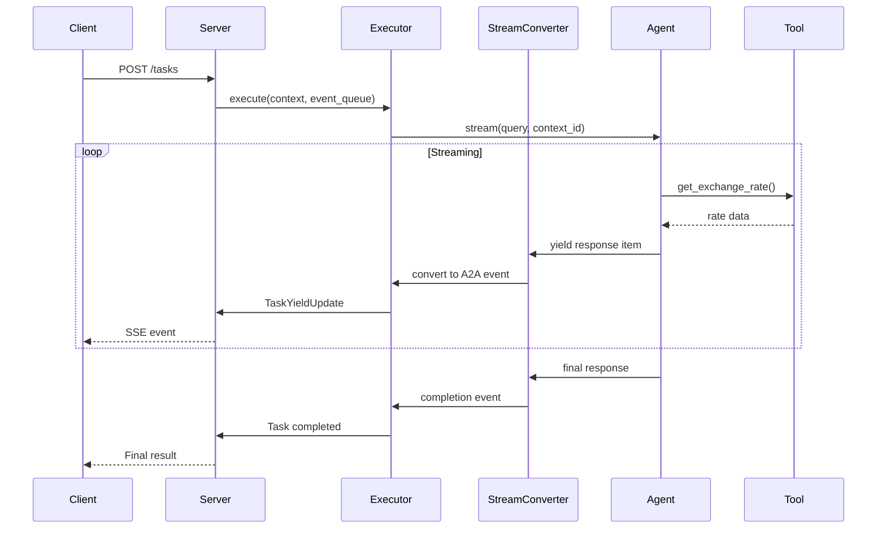

# Currency Agent - A2A Protocol with LangGraph

A currency exchange rate agent built with the A2A (Agent-to-Agent) protocol and LangGraph, following the **Practical A2A LangGraph Agent Project Structure v0.2.0** architecture.

## Table of Contents

1. [Architecture Overview](#architecture-overview)
2. [Detailed Structure](#detailed-structure)
3. [Component Documentation](#component-documentation)
4. [Data Flow](#data-flow)
5. [Installation & Usage](#installation--usage)
6. [Development Guidelines](#development-guidelines)

## Architecture Overview

This project implements the **v0.2.0 structure** from our best practices, which introduces an **adapters layer** for clean separation between the A2A protocol and LangGraph implementation. This version was chosen for its balance between modularity and complexity, making it ideal for production-ready agents.

### Why v0.2.0?

- **v0.1.0**: Basic modular structure but lacks protocol abstraction
- **v0.2.0**: ✅ **Selected** - Adds adapters layer for clean protocol bridging
- **v0.3.0**: Includes checkpointing (not needed for this simple agent)
- **v0.4.0**: Fully modular with subsystems (overly complex for single agent)

## Detailed Structure

```
currency-agent/
├── src/
│   └── currency_agent/
│       ├── __init__.py
│       │
│       ├── core/                    # Core LangGraph Agent Logic
│       │   ├── __init__.py
│       │   ├── agent.py            # Main LangGraph agent implementation
│       │   ├── state.py            # Agent state definitions (ResponseFormat)
│       │   ├── tools.py            # Currency exchange rate tool
│       │   └── prompts.py          # System and format instructions
│       │
│       ├── adapters/               # Protocol Adapters (A2A ↔ LangGraph)
│       │   ├── __init__.py
│       │   ├── a2a_executor.py    # Bridges A2A requests to LangGraph
│       │   └── stream_converter.py # Converts LangGraph streams to A2A events
│       │
│       ├── server/                 # A2A Server Implementation
│       │   ├── __init__.py
│       │   ├── app.py             # Creates A2A Starlette application
│       │   └── models.py          # Agent card and capability definitions
│       │
│       ├── client/                 # A2A Client Implementation
│       │   ├── __init__.py
│       │   └── test_client.py     # Example client for testing
│       │
│       ├── common/                 # Shared Utilities
│       │   ├── __init__.py
│       │   ├── config.py          # Configuration management
│       │   ├── logging.py         # Logging setup
│       │   └── exceptions.py      # Custom exception definitions
│       │
│       └── main.py                # Entry point with CLI interface
│
├── examples/                      # Usage examples
│   └── run_server.py             # Example server startup script
│
├── tests/                        # Test directories (to be implemented)
│   ├── unit/
│   ├── integration/
│   └── fixtures/
│
├── pyproject.toml               # Project configuration (uv)
├── README.md                    # This file
└── .env.example                # Environment variable template
```

## Component Documentation

### Core Components (`core/`)

#### `agent.py` - LangGraph Agent Implementation
```python
class CurrencyAgent:
    """
    Currency conversion agent using LangGraph.
    
    This agent specializes in currency exchange rate queries using
    the ReAct pattern for tool usage and reasoning.
    
    Key features:
    - Real-time exchange rate lookup via tools
    - Structured response format
    - Multi-turn conversation support
    - Streaming response capability
    """
```

- **Purpose**: Implements the main agent logic using LangGraph's ReAct pattern
- **Key Methods**:
  - `__init__()`: Initializes LLM, tools, and creates the ReAct graph
  - `stream()`: Async generator that streams agent responses
  - `get_agent_response()`: Processes final agent state into response format
- **Dependencies**: LangChain, LangGraph, OpenAI/Google AI

#### `tools.py` - Currency Exchange Tool
```python
@tool
def get_exchange_rate(
    currency_from: str = 'USD',
    currency_to: str = 'EUR',
    currency_date: str = 'latest',
) -> Dict[str, Any]:
```

- **Purpose**: Provides real-time exchange rate data via Frankfurter API
- **Features**: Error handling, input validation, JSON response parsing
- **External API**: https://api.frankfurter.app/

#### `state.py` - State Definitions
```python
class ResponseFormat(BaseModel):
    status: Literal['input_required', 'completed', 'error']
    message: str
```

- **Purpose**: Defines structured response format for consistent client parsing
- **States**:
  - `input_required`: Agent needs more information
  - `completed`: Request successfully processed
  - `error`: Error occurred during processing

#### `prompts.py` - Agent Instructions
- **SYSTEM_INSTRUCTION**: Defines agent's role and constraints
- **FORMAT_INSTRUCTION**: Guides structured response generation

### Adapter Components (`adapters/`)

#### `a2a_executor.py` - A2A to LangGraph Bridge
```python
class CurrencyAgentExecutor(AgentExecutor):
    """
    A2A Protocol executor for the Currency Agent.
    
    This class bridges the A2A protocol with the LangGraph-based
    CurrencyAgent, handling request execution and response formatting.
    """
```

- **Purpose**: Implements A2A's AgentExecutor interface
- **Responsibilities**:
  - Validate incoming A2A requests
  - Create/manage A2A tasks
  - Delegate to CurrencyAgent
  - Handle errors and exceptions
- **Key Methods**:
  - `execute()`: Main execution flow
  - `_validate_request()`: Request validation
  - `cancel()`: Task cancellation (not implemented)

#### `stream_converter.py` - Stream Format Converter
```python
class StreamConverter:
    """
    Converts LangGraph streaming responses to A2A protocol events.
    """
```

- **Purpose**: Translates between streaming formats
- **Conversions**:
  - LangGraph response items → A2A TaskYieldUpdate events
  - Agent states → A2A TaskState enum
  - Response content → A2A Message/Artifact format

### Server Components (`server/`)

#### `app.py` - A2A Server Application
```python
def create_app(host: str = 'localhost', port: int = 10000) -> A2AStarletteApplication:
```

- **Purpose**: Creates and configures the A2A server
- **Components**:
  - HTTP client for push notifications
  - Request handler with executor
  - In-memory task store
  - Agent card configuration

#### `models.py` - A2A Protocol Models
```python
def create_agent_card(host: str, port: int) -> AgentCard:
```

- **Purpose**: Defines agent metadata and capabilities
- **Includes**:
  - Agent name, description, version
  - Supported input/output modes
  - Capabilities (streaming, push notifications)
  - Skills and examples

### Common Components (`common/`)

#### `config.py` - Configuration Management
```python
class Config:
    """Configuration management for the Currency Agent."""
```

- **Purpose**: Centralized configuration from environment variables
- **Managed Settings**:
  - Model source (OpenAI, Google, etc.)
  - Model name and temperature
  - API keys
- **Validation**: Ensures required configuration is present

#### `logging.py` - Logging Setup
- **Purpose**: Configures application-wide logging
- **Features**: Log level control, format standardization

#### `exceptions.py` - Custom Exceptions
- **Hierarchy**:
  - `CurrencyAgentError`: Base exception
  - `ConfigurationError`: Configuration issues
  - `MissingAPIKeyError`: Missing API keys
  - `AgentExecutionError`: Runtime errors

### Entry Point (`main.py`)

```python
@click.command()
@click.option('--host', default='localhost')
@click.option('--port', default=10000, type=int)
@click.option('--log-level', default='INFO')
def main(host: str, port: int, log_level: str) -> None:
```

- **Purpose**: CLI entry point for the server
- **Features**:
  - Command-line argument parsing
  - Configuration validation
  - Server initialization and startup
  - Error handling and logging

## Data Flow

### 1. Request Flow
```
A2A Client → HTTP Request → A2A Server → RequestHandler → CurrencyAgentExecutor
```

### 2. Execution Flow
```
CurrencyAgentExecutor → CurrencyAgent → LangGraph ReAct → get_exchange_rate tool → Frankfurter API
```

### 3. Response Flow
```
Agent Response → StreamConverter → A2A Events → TaskUpdater → EventQueue → SSE Stream → A2A Client
```

### 4. Streaming Sequence



## Installation & Usage

### Prerequisites

- Python 3.12+
- [uv](https://docs.astral.sh/uv/) package manager

### Installation

```bash
# Clone the repository
git clone <repository-url>
cd currency-agent

# Install dependencies with uv
uv sync
```

### Configuration

Create a `.env` file:

```env
# Model Configuration
TOOL_MODEL_SRC=openai              # Model source: 'openai' or 'google'
TOOL_MODEL_NAME=gpt-4o-mini        # Model name
TOOL_MODEL_TEMPERATURE=0           # Temperature (0-1)

# API Keys
TOOL_API_KEY=your-api-key          # Your OpenAI/Google API key
```

### Running the Server

```bash
# Using the CLI entry point
uv run currency-agent --host localhost --port 10000

# Or using Python module
uv run python -m src.currency_agent.main

# With custom options
uv run currency-agent --host 0.0.0.0 --port 8080 --log-level DEBUG
```

### Testing the Agent

```bash
# Run automated test examples
uv run python src/currency_agent/client/test_client.py

# Interactive mode
uv run python src/currency_agent/client/test_client.py --interactive

# Test specific URL
uv run python src/currency_agent/client/test_client.py --url http://localhost:8080
```

### Example Queries

1. **Simple Exchange Rate**:
   - "What is the exchange rate from USD to EUR?"
   - "Show me GBP to JPY rate"

2. **Conversion Requests**:
   - "Convert 100 USD to EUR"
   - "How much is 50 GBP in CHF?"

3. **Historical Rates**:
   - "USD to EUR rate on 2024-01-01"
   - "Show me the exchange rate from USD to GBP for December 1st, 2023"

4. **Invalid Requests** (will be politely declined):
   - "What's the weather today?"
   - "Tell me a joke"

## Development Guidelines

### Adding New Tools

1. Create tool function in `core/tools.py`
2. Add `@tool` decorator from langchain_core
3. Include in agent's tool list in `core/agent.py`
4. Update prompts if needed

### Extending the Agent

1. **New State Types**: Add to `core/state.py`
2. **New Prompts**: Update `core/prompts.py`
3. **Protocol Changes**: Modify adapters in `adapters/`
4. **Server Features**: Update `server/app.py`

### Testing Strategy

1. **Unit Tests** (`tests/unit/`):
   - Test individual components
   - Mock external dependencies
   - Focus on business logic

2. **Integration Tests** (`tests/integration/`):
   - Test component interactions
   - Use test fixtures
   - Verify A2A protocol compliance

3. **End-to-End Tests**:
   - Use `client/test_client.py`
   - Test full request/response cycle
   - Verify streaming behavior

### Code Style

- Use type hints throughout
- Add docstrings to all classes and functions
- Follow PEP 8 guidelines
- Keep functions focused and single-purpose

### Error Handling

1. Use custom exceptions from `common/exceptions.py`
2. Log errors appropriately
3. Return user-friendly error messages
4. Maintain A2A protocol error standards

## A2A Protocol Implementation

### Supported Features

- ✅ Task creation and management
- ✅ Streaming responses (SSE)
- ✅ Multi-turn conversations
- ✅ Structured responses
- ✅ Error handling
- ✅ Agent discovery (/.well-known/agent.json)

### Task States

- `working`: Agent is processing
- `input_required`: Needs user input
- `completed`: Task finished successfully
- `error`: Task failed

### Message Types

- User messages: Text input from clients
- Agent messages: Progress updates
- Artifacts: Final results

## Future Enhancements

1. **Checkpointing** (v0.3.0 features):
   - Add persistence layer
   - Implement state recovery
   - Support long-running conversations

2. **Additional Tools**:
   - Historical rate analysis
   - Currency trend predictions
   - Multi-currency conversions

3. **Protocol Extensions**:
   - Batch processing
   - Scheduled tasks
   - Advanced streaming control

## Troubleshooting

### Common Issues

1. **API Key Errors**:
   - Ensure `.env` file exists
   - Check `TOOL_API_KEY` is set
   - Verify key permissions

2. **Connection Errors**:
   - Check Frankfurter API status
   - Verify network connectivity
   - Review firewall settings

3. **Model Errors**:
   - Confirm model name is correct
   - Check API quotas
   - Review rate limits

### Debug Mode

```bash
# Enable debug logging
uv run currency-agent --log-level DEBUG

# Check server logs
tail -f server.log
```

## License

[Include license information]

## Contributing

[Include contribution guidelines]