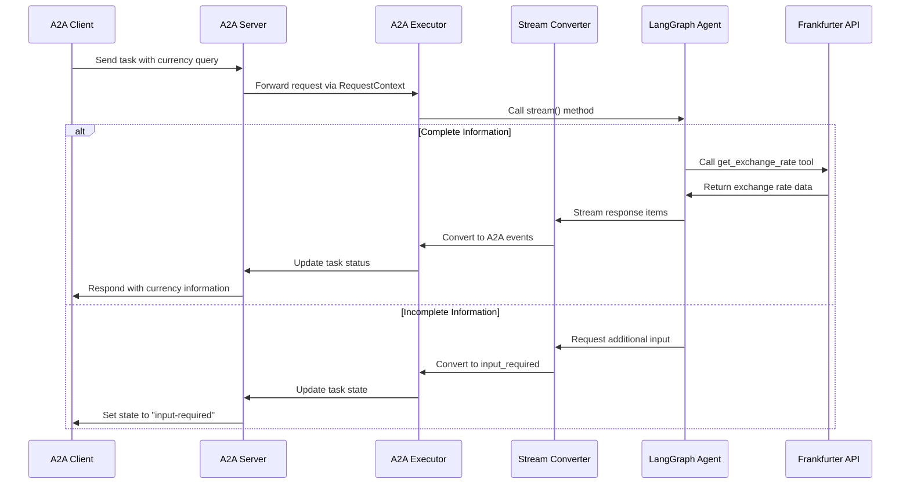

# Currency Agent - A2A Protocol with LangGraph (v2.0.0)

A currency exchange rate agent built with the A2A (Agent-to-Agent) protocol and LangGraph, following a modular v0.2.0 architecture.

## Architecture

This project follows a clean, modular architecture:

```
src/currency_agent/
├── core/           # Core agent logic (LangGraph)
├── adapters/       # Protocol adapters (A2A ↔ LangGraph bridge)
├── server/         # A2A server implementation
├── client/         # A2A client utilities
└── common/         # Shared utilities
```

## Features

- Real-time currency exchange rate lookups
- A2A protocol compliance
- Streaming responses
- Multi-turn conversations
- Clean separation between A2A protocol and LangGraph logic

## Installation

```bash
# Install uv if not already installed
curl -LsSf https://astral.sh/uv/install.sh | sh

# Install dependencies
uv sync
```

### Alternative: Direct script execution

With uv, you can also run the agent directly using the installed script:

```bash
# After installation, you can use:
uv run currency-agent --help
```

## Configuration

Create a `.env` file with your API keys:

```env
TOOL_MODEL_SRC=openai
TOOL_MODEL_NAME=gpt-4o-mini
TOOL_MODEL_TEMPERATURE=0
TOOL_API_KEY=your-openai-api-key
```

## Running the Agent

### As a Server

```bash
# Run with default settings (localhost:10000)
uv run python -m src.currency_agent.main

# Or with custom host/port
uv run python -m src.currency_agent.main --host 0.0.0.0 --port 8080
```

### Testing the Agent

```bash
# Run example queries
uv run python src/currency_agent/client/test_client.py

# Run interactive session
uv run python src/currency_agent/client/test_client.py --interactive
```

## Example Queries

- "What is the exchange rate from USD to EUR?"
- "Convert 100 GBP to JPY"
- "Show me USD to CHF rate for 2024-01-01"

## Project Structure Benefits

The v0.2.0 structure provides:

1. **Modularity**: Clear separation of concerns between core logic, protocol handling, and server implementation
2. **Adapter Pattern**: Clean bridge between A2A protocol and LangGraph through the adapters layer
3. **Extensibility**: Easy to add new tools, prompts, or protocol features
4. **Maintainability**: Each component can be updated independently
5. **Testability**: Modular structure makes unit testing straightforward

## Key Components

- **Core Agent** (`core/agent.py`): LangGraph-based agent implementation
- **A2A Executor** (`adapters/a2a_executor.py`): Bridges A2A requests to LangGraph
- **Stream Converter** (`adapters/stream_converter.py`): Converts LangGraph streams to A2A events
- **Server App** (`server/app.py`): A2A-compliant server setup

## How It Works



## Development

This architecture is designed to support:
- Multiple agents in the same codebase
- Easy protocol updates
- Clean testing strategies
- Future checkpointing/persistence additions

## Migration from v1.0

The main changes from the original flat structure:
1. Code is now organized into logical modules
2. A2A protocol handling is separated from agent logic
3. Streaming conversion is handled by dedicated adapter
4. Configuration and logging are centralized
5. Better error handling and custom exceptions